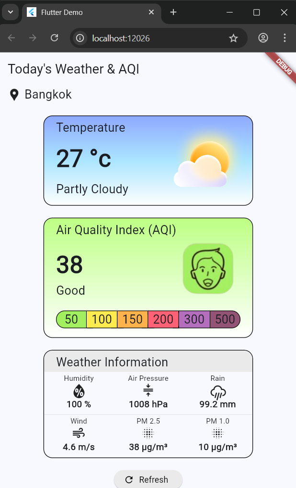

# first-mobile-application
This project is a simple mobile application built with Flutter to display real-time air quality data. It was developed as a personal assignment to practice API integration and custom UI/UX design.

The app fetches data from the [World Air Quality Index (WAQI) API](https://aqicn.org/api/)

The primary files related to this assignment are:
-   **API Service:** `lib/api/api_assignment.dart`
-   **Data Model:** `lib/models/aqi.dart` & `lib/models/aqi_display.dart`

Here are the screenshots of the application 

